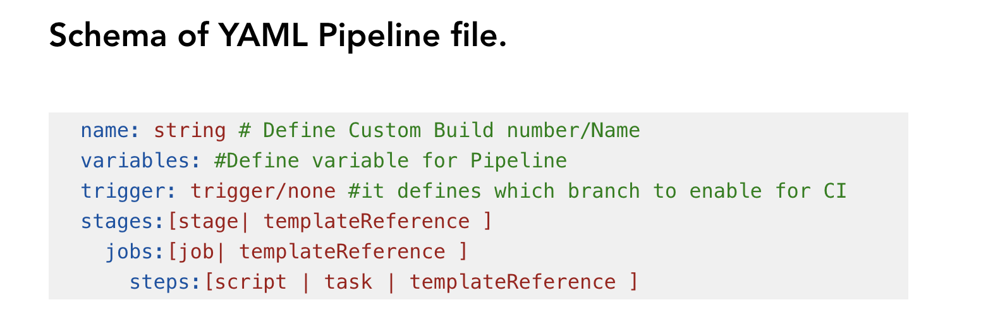

# LetsDevOps: YAML Pipeline Tutorial, Setting up CI/CD using YAML Pipeline, Multi Stage/Job Setup.

## Introduction

This article is for understanding the core concept of YAML Pipeline in Azure DevOps. Further it describe how you can write your own YAML file to implement CI/CD.

### What is YAML

YAML is a human-readable data-serialization language and it helps to configure pipeline as a Code.
The page will reload when you make changes.\
You may also see any lint errors in the console.

`Indentation is very important in YAML.`

## YAML Pipeline

In Azure DevOps, Pipelines helps to setup Continuous Integration/ Continuous Deployment and to achieve
this we have below two option .

1. Classic Editor.
2. YAML Pipeline.

In this Document we will discuss setup YAML Pipeline.
# YAML Pipeline Structure 

# Hierarchy of YAML File

# Component of YAML Pipeline
Here is the list of component which we use in YAML pipeline creation.

1. Stages.
Stage is collection of Jobs which runs sequentially.

2. Jobs.
Job is Collection of Steps that runs on agents/environment.

3. Steps.
Steps helps to define the set of process to setup your task or any activity which you want to perform on any specific job.

Kind of Steps
+ `Task`
+ `Script`
+ `templatereference`

# Schema of YAML Pipeline file.

# `Important Note:-`

1.In some cases if there is only one stage required for pipeline we can omit stage keyword and can directly start from Jobs.

2. In some build setup where only one agent is required for pipeline in that case we can omit Job and directly define the Steps.

# DEMO:
We can begin with demo to setup YAML pipeline for below three scenarios.

`Single Stage, Single Job YAML Pipeline`
`Single Stage Multi Job YAML Pipeline`
`Multi Stage YAML Pipeline`

1. Single Stage, Single Job YAML Pipeline

Assume that if you have assigned to setup build for an application. In this scenario we can omit stages or Jobs.

Here you can notice that we did not include the Stage and Job section  in the YAML pipeline as it is not required in this scenario.

2. Single Stage Multi Job YAML Pipeline

Let's assume you have to perform some activity on different Agent. Like building application on Windows, Mac OS, Linux. In this scenario we can create multiple job and each job can be assigned with respective agent.

3. Multi Stage YAML Pipeline.

In this scenario you have assigned one application where you need to build the Project, package it. After that you need to deploy the application. In this case we can create two stage.

Stage1 --> Build the Application
Stage 2 --> Deploy the Application

For more watch this video

[YAML Pipeline Tutorial](https://www.youtube.com/watch?v=JtbG6WkLGng&ab_channel=SumitRaj)
